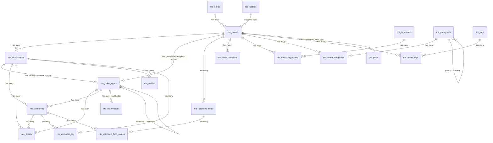

# Database Schema Reference

> **Audience:** Plugin developers, integrators writing add-ons, and anyone reading or modifying the schema.

**Last Updated:** 2026-04-20

Complete reference for the **20 custom database tables** in the NetterTech Events core plugin. Tables use the WordPress table prefix (typically `wp_`) followed by `nte_`. Additional tables are activated by add-on plugins (see [Add-on Tables](#add-on-tables-deferred)).

> **Architecture context:** See [ADR-001](architecture/ADR-001-custom-database-tables.md) for why custom tables over `post_meta`, and [ADR-009](architecture/ADR-009-referential-integrity.md) for the application-level integrity approach.

## Table of Contents

- [Overview](#overview)
- [Core Entity Tables](#core-entity-tables)
  - [nte_series](#nte_series)
  - [nte_events](#nte_events)
  - [nte_occurrences](#nte_occurrences)
  - [nte_spaces](#nte_spaces)
- [Ticketing Tables](#ticketing-tables)
  - [nte_ticket_types](#nte_ticket_types)
  - [nte_tickets](#nte_tickets)
  - [nte_attendees](#nte_attendees)
  - [nte_waitlist](#nte_waitlist)
  - [nte_reservations](#nte_reservations)
- [Registration Field Tables](#registration-field-tables)
  - [nte_attendee_fields](#nte_attendee_fields)
  - [nte_attendee_field_values](#nte_attendee_field_values)
- [Taxonomy Tables](#taxonomy-tables)
  - [nte_organizers](#nte_organizers)
  - [nte_event_organizers](#nte_event_organizers)
  - [nte_categories](#nte_categories)
  - [nte_event_categories](#nte_event_categories)
  - [nte_tags](#nte_tags)
  - [nte_event_tags](#nte_event_tags)
- [System Tables](#system-tables)
  - [nte_activity_log](#nte_activity_log)
  - [nte_reminder_log](#nte_reminder_log)
  - [nte_event_revisions](#nte_event_revisions)
- [Add-on Tables (Deferred)](#add-on-tables-deferred)
- [Relationships](#relationships)
- [Index Strategy](#index-strategy)
- [Conventions](#conventions)

## Overview

| Table | Purpose | Rows (typical) |
|-------|---------|----------------|
| `nte_series` | Series groupings for recurring events | 10–50 |
| `nte_events` | Event definitions | 50–500 |
| `nte_occurrences` | Pre-computed event instances | 500–5,000 |
| `nte_spaces` | Bookable rooms/venues (core properties) | 5–50 |
| `nte_ticket_types` | Pricing tiers (3-scope model) | 100–2,000 |
| `nte_tickets` | Individual tickets with codes | 1,000–50,000 |
| `nte_attendees` | Registration records | 1,000–50,000 |
| `nte_waitlist` | Sold-out queue entries | 0–500 |
| `nte_reservations` | Per-session cart capacity holds | 0–500 |
| `nte_attendee_fields` | Custom registration field definitions | 10–100 |
| `nte_attendee_field_values` | Attendee responses to custom fields (EAV) | 100–10,000 |
| `nte_organizers` | Event organizer profiles | 10–100 |
| `nte_event_organizers` | Event ↔ Organizer junction | 50–500 |
| `nte_categories` | Hierarchical event categories | 5–50 |
| `nte_event_categories` | Event ↔ Category junction | 50–500 |
| `nte_tags` | Flat event tags | 10–100 |
| `nte_event_tags` | Event ↔ Tag junction | 50–500 |
| `nte_activity_log` | Admin action audit trail | 1,000–100,000 |
| `nte_reminder_log` | Sent reminder dedup records | 500–10,000 |
| `nte_event_revisions` | Pre-save event snapshots | 500–10,000 |

**Creation order** respects dependencies — tables with no foreign references are created first. See `Schema::get_table_definitions()` for the authoritative order.

---

## Core Entity Tables

### nte_series

Groups related recurring events (e.g., "Friday Night Jazz"). Optional — only used when events belong to a named series.

| Column | Type | Constraints | Description |
|--------|------|-------------|-------------|
| `id` | `bigint(20) unsigned` | PK, AUTO_INCREMENT | Series ID |
| `title` | `varchar(255)` | NOT NULL | Display name |
| `slug` | `varchar(255)` | NOT NULL, UNIQUE | URL identifier |
| `description` | `text` | NULL | Series description |
| `featured_image_id` | `bigint(20) unsigned` | NULL | WP attachment ID |
| `pass_enabled` | `tinyint(1)` | DEFAULT 0 | Series pass available |
| `pass_price` | `decimal(10,2)` | NULL | Pass price |
| `created_at` | `datetime` | NOT NULL, DEFAULT CURRENT_TIMESTAMP | Created |
| `updated_at` | `datetime` | NOT NULL, auto-updates | Modified |

**Indexes:** PRIMARY (`id`), UNIQUE (`slug`)

---

### nte_events

Core event entity. Contains title, description, venue info, recurrence rules, and status.

| Column | Type | Constraints | Description |
|--------|------|-------------|-------------|
| `id` | `bigint(20) unsigned` | PK, AUTO_INCREMENT | Event ID |
| `post_id` | `bigint(20) unsigned` | NULL | Linked WP post (optional) |
| `title` | `varchar(255)` | NOT NULL | Event title |
| `slug` | `varchar(255)` | NOT NULL, UNIQUE | URL identifier |
| `description` | `longtext` | NULL | Full description (HTML) |
| `excerpt` | `text` | NULL | Short description |
| `featured_image_id` | `bigint(20) unsigned` | NULL | WP attachment ID |
| `status` | `varchar(20)` | DEFAULT 'draft' | draft / published |
| `event_type` | `varchar(20)` | DEFAULT 'single' | single / recurring |
| `series_id` | `bigint(20) unsigned` | NULL | FK → `nte_series.id` |
| `venue_name` | `varchar(255)` | NULL | Venue display name |
| `venue_address` | `text` | NULL | Venue address |
| `recurrence_rule` | `text` | NULL | iCal RRULE string |
| `recurrence_end_date` | `date` | NULL | Recurrence end boundary |
| `layout_config` | `text` | NULL | Seating layout JSON |
| `reminders_enabled` | `tinyint(1)` | NULL | Email reminders on/off |
| `notification_emails` | `text` | NULL | JSON-encoded list of notification addresses |
| `custom_fields` | `JSON` | NULL | Arbitrary event metadata |
| `is_virtual` | `tinyint(1)` | NULL | Virtual-event flag |
| `virtual_url` | `varchar(500)` | NULL | Virtual-event join URL |
| `collect_individual_attendees` | `tinyint(1)` | NULL | Collect per-attendee fields at checkout |
| `qr_logo_mode` | `varchar(20)` | NULL | `default` / `custom` / `none` |
| `qr_logo_attachment_id` | `bigint(20) unsigned` | NULL | WP attachment for QR center logo |
| `space_id` | `bigint(20) unsigned` | NULL | FK → `nte_spaces.id` |
| `created_at` | `datetime` | NOT NULL, DEFAULT CURRENT_TIMESTAMP | Created |
| `updated_at` | `datetime` | NOT NULL, auto-updates | Modified |

**Indexes:** PRIMARY (`id`), UNIQUE (`slug`), KEY (`post_id`), KEY (`series_id`), KEY (`status`), KEY (`event_type`)

---

### nte_occurrences

Pre-computed event instances for fast calendar queries. Each row is one showing of an event. Generated from recurrence rules by `OccurrenceGenerator`.

| Column | Type | Constraints | Description |
|--------|------|-------------|-------------|
| `id` | `bigint(20) unsigned` | PK, AUTO_INCREMENT | Occurrence ID |
| `event_id` | `bigint(20) unsigned` | NOT NULL | FK → `nte_events.id` |
| `start_datetime` | `datetime` | NOT NULL | Start time |
| `end_datetime` | `datetime` | NOT NULL | End time |
| `all_day` | `tinyint(1)` | DEFAULT 0 | All-day flag |
| `timezone` | `varchar(50)` | DEFAULT 'UTC' | IANA timezone |
| `title_override` | `varchar(255)` | NULL | Override parent title |
| `description_override` | `longtext` | NULL | Override parent description |
| `featured_image_id` | `bigint(20) unsigned` | NULL | Override parent image |
| `status` | `varchar(20)` | DEFAULT 'scheduled' | scheduled / cancelled / completed |
| `capacity` | `int(10) unsigned` | NULL | Max attendees |
| `sequence_number` | `int(10) unsigned` | DEFAULT 1 | Position in series |
| `is_rescheduled` | `tinyint(1)` | DEFAULT 0 | Rescheduled flag |
| `checkin_token` | `varchar(96)` | NULL, UNIQUE | Volunteer check-in URL token |
| `created_at` | `datetime` | NOT NULL, DEFAULT CURRENT_TIMESTAMP | Created |
| `updated_at` | `datetime` | NOT NULL, auto-updates | Modified |

**Indexes:** PRIMARY (`id`), UNIQUE (`checkin_token`), KEY (`event_id`), KEY (`start_datetime`), KEY (`end_datetime`), KEY (`status`), KEY `calendar_query` (`start_datetime`, `end_datetime`, `status`), KEY `event_schedule` (`event_id`, `start_datetime`)

**Key composite indexes:**
- `calendar_query` — optimizes month/week/day calendar views
- `event_schedule` — optimizes "upcoming occurrences for this event" queries

---

### nte_spaces

Bookable rooms/venues. Core properties only — the Rentals add-on appends rental-specific columns (hourly/daily rates, buffer windows, booking durations) via `ALTER TABLE`.

| Column | Type | Constraints | Description |
|--------|------|-------------|-------------|
| `id` | `bigint(20) unsigned` | PK, AUTO_INCREMENT | Space ID |
| `name` | `varchar(255)` | NOT NULL | Display name |
| `slug` | `varchar(255)` | NOT NULL, UNIQUE | URL identifier |
| `capacity` | `int(10) unsigned` | NOT NULL, DEFAULT 0 | Maximum occupancy |
| `square_footage` | `int(10) unsigned` | NULL | Floor area |
| `description` | `text` | NULL | Description |
| `featured_image_id` | `bigint(20) unsigned` | NULL | WP attachment ID |
| `sort_order` | `int(11)` | DEFAULT 0 | Display order |
| `status` | `varchar(20)` | DEFAULT 'active' | active / inactive |
| `is_accessible` | `tinyint(1)` | NOT NULL, DEFAULT 0 | Wheelchair accessible |
| `has_accessible_stage` | `tinyint(1)` | NOT NULL, DEFAULT 0 | Accessible stage access |
| `has_hearing_loop` | `tinyint(1)` | NOT NULL, DEFAULT 0 | Hearing loop installed |
| `has_assigned_seating` | `tinyint(1)` | NOT NULL, DEFAULT 0 | Assigned (vs. general) seating |
| `amenities` | `text` | NULL | Comma-separated or JSON amenity list |
| `gallery_image_ids` | `text` | NULL | Comma-separated WP attachment IDs |
| `created_at` | `datetime` | NOT NULL, DEFAULT CURRENT_TIMESTAMP | Created |
| `updated_at` | `datetime` | NOT NULL, auto-updates | Modified |

**Indexes:** PRIMARY (`id`), UNIQUE (`slug`), KEY (`status`)

---

## Ticketing Tables

### nte_ticket_types

Three-tier scoping model: occurrence-specific, event-wide, or template ticket types. See [ADR-005](architecture/ADR-005-capacity-model.md) for the capacity model.

| Column | Type | Constraints | Description |
|--------|------|-------------|-------------|
| `id` | `bigint(20) unsigned` | PK, AUTO_INCREMENT | Ticket type ID |
| `scope` | `varchar(20)` | NOT NULL, DEFAULT 'occurrence' | occurrence / event / template |
| `event_id` | `bigint(20) unsigned` | NULL | FK → `nte_events.id` |
| `template_id` | `bigint(20) unsigned` | NULL | FK → `nte_ticket_types.id` (self-ref) |
| `occurrence_id` | `bigint(20) unsigned` | NULL | FK → `nte_occurrences.id` |
| `name` | `varchar(255)` | NOT NULL | Display name (e.g., "General Admission") |
| `description` | `text` | NULL | Description |
| `price` | `decimal(10,2)` | NOT NULL, DEFAULT 0.00 | Unit price |
| `capacity_type` | `varchar(20)` | NOT NULL, DEFAULT 'fixed' | fixed / unlimited |
| `capacity` | `int(10) unsigned` | NULL | Max tickets (NULL = unlimited) |
| `sold_count` | `int(10) unsigned` | NOT NULL, DEFAULT 0 | Atomic counter |
| `stock_status` | `varchar(20)` | NOT NULL, DEFAULT 'in_stock' | in_stock / out_of_stock |
| `sale_start` | `datetime` | NULL | Sales window open |
| `sale_end` | `datetime` | NULL | Sales window close |
| `min_per_order` | `int(10) unsigned` | DEFAULT 1 | Min purchase qty |
| `max_per_order` | `int(10) unsigned` | DEFAULT 10 | Max purchase qty |
| `sort_order` | `int(11)` | DEFAULT 0 | Display order |
| `status` | `varchar(20)` | DEFAULT 'active' | active / inactive |
| `wc_product_id` | `bigint(20) unsigned` | NULL | WooCommerce product ID |
| `wc_variation_id` | `bigint(20) unsigned` | NULL | WooCommerce variation ID |
| `reserved` | `int(10) unsigned` | NOT NULL, DEFAULT 0 | Atomic cart-hold counter (aggregate of `nte_reservations` rows) |
| `source` | `varchar(20)` | DEFAULT 'woocommerce' | woocommerce / rsvp / external |
| `created_at` | `datetime` | NOT NULL, DEFAULT CURRENT_TIMESTAMP | Created |
| `updated_at` | `datetime` | NOT NULL, auto-updates | Modified |

**Indexes:** PRIMARY (`id`), KEY (`occurrence_id`), KEY (`event_id`), KEY (`template_id`), KEY (`scope`), KEY (`wc_product_id`), KEY (`status`), KEY `occurrence_status` (`occurrence_id`, `status`), KEY `event_scope` (`event_id`, `scope`), KEY (`stock_status`), KEY (`source`)

---

### nte_tickets

Individual tickets with unique scan codes and QR references. One ticket per person per ticket type.

| Column | Type | Constraints | Description |
|--------|------|-------------|-------------|
| `id` | `bigint(20) unsigned` | PK, AUTO_INCREMENT | Ticket ID |
| `ticket_type_id` | `bigint(20) unsigned` | NOT NULL | FK → `nte_ticket_types.id` |
| `occurrence_id` | `bigint(20) unsigned` | NOT NULL | FK → `nte_occurrences.id` |
| `attendee_id` | `bigint(20) unsigned` | NULL | FK → `nte_attendees.id` |
| `wc_order_id` | `bigint(20) unsigned` | NULL | WooCommerce order ID |
| `wc_order_item_id` | `bigint(20) unsigned` | NULL | WooCommerce order item ID |
| `ticket_code` | `varchar(64)` | NOT NULL, UNIQUE | Scannable code (XXXX-XXXX-XXXX-XXXX) |
| `qr_code_url` | `varchar(255)` | NULL | Path to generated QR image |
| `status` | `varchar(20)` | DEFAULT 'pending' | pending / valid / used / cancelled |
| `checked_in_at` | `datetime` | NULL | Check-in timestamp |
| `price_paid` | `decimal(10,2)` | NOT NULL | Amount paid |
| `created_at` | `datetime` | NOT NULL, DEFAULT CURRENT_TIMESTAMP | Created |
| `updated_at` | `datetime` | NOT NULL, auto-updates | Modified |

**Indexes:** PRIMARY (`id`), UNIQUE (`ticket_code`), KEY (`ticket_type_id`), KEY (`occurrence_id`), KEY (`attendee_id`), KEY (`wc_order_id`), KEY (`status`)

---

### nte_attendees

Registration records for check-in. One record per order/RSVP. Stores party size (`quantity`) — a single attendee may represent multiple people.

| Column | Type | Constraints | Description |
|--------|------|-------------|-------------|
| `id` | `bigint(20) unsigned` | PK, AUTO_INCREMENT | Attendee ID |
| `occurrence_id` | `bigint(20) unsigned` | NOT NULL | FK → `nte_occurrences.id` |
| `ticket_type_id` | `bigint(20) unsigned` | NULL | FK → `nte_ticket_types.id` |
| `wc_order_id` | `bigint(20) unsigned` | NULL | WooCommerce order ID |
| `source` | `varchar(20)` | DEFAULT 'woocommerce' | woocommerce / rsvp / manual |
| `name` | `varchar(255)` | NOT NULL | Attendee name |
| `email` | `varchar(255)` | NOT NULL | Attendee email |
| `phone` | `varchar(50)` | NULL | Phone |
| `quantity` | `int(10) unsigned` | NOT NULL, DEFAULT 1 | Party size |
| `status` | `varchar(20)` | DEFAULT 'confirmed' | confirmed / cancelled |
| `checked_in` | `tinyint(1)` | DEFAULT 0 | Any in party checked in |
| `checked_in_count` | `int(10) unsigned` | NOT NULL, DEFAULT 0 | Count checked in |
| `checked_in_at` | `datetime` | NULL | First check-in time |
| `notes` | `text` | NULL | Staff notes |
| `accessibility_notes` | `text` | NULL | Accessibility needs |
| `created_at` | `datetime` | NOT NULL, DEFAULT CURRENT_TIMESTAMP | Created |
| `updated_at` | `datetime` | NOT NULL, auto-updates | Modified |

**Indexes:** PRIMARY (`id`), KEY (`ticket_type_id`), KEY (`wc_order_id`), KEY (`source`), KEY (`email`), KEY (`checked_in`), KEY `checkin_query` (`occurrence_id`, `checked_in`), KEY `occurrence_status` (`occurrence_id`, `status`), KEY `occurrence_email` (`occurrence_id`, `email`)

**Key composite indexes:**
- `checkin_query` — optimizes check-in page filtering
- `occurrence_status` — optimizes confirmed attendee counts
- `occurrence_email` — optimizes duplicate email detection at registration

---

### nte_waitlist

Queue entries for sold-out occurrences. One entry per email per occurrence (enforced by unique constraint).

| Column | Type | Constraints | Description |
|--------|------|-------------|-------------|
| `id` | `bigint(20) unsigned` | PK, AUTO_INCREMENT | Entry ID |
| `occurrence_id` | `bigint(20) unsigned` | NOT NULL | FK → `nte_occurrences.id` |
| `ticket_type_id` | `bigint(20) unsigned` | NULL | Requested ticket type |
| `email` | `varchar(255)` | NOT NULL | Waitlist email |
| `name` | `varchar(255)` | NOT NULL | Waitlist name |
| `phone` | `varchar(50)` | NULL | Phone |
| `position` | `int(10) unsigned` | NOT NULL, DEFAULT 0 | Queue position |
| `status` | `varchar(20)` | NOT NULL, DEFAULT 'waiting' | waiting / notified / converted |
| `notified_at` | `datetime` | NULL | Notification timestamp |
| `created_at` | `datetime` | NOT NULL, DEFAULT CURRENT_TIMESTAMP | Created |
| `updated_at` | `datetime` | NOT NULL, auto-updates | Modified |

**Indexes:** PRIMARY (`id`), UNIQUE `occurrence_email` (`occurrence_id`, `email`), KEY (`ticket_type_id`), KEY (`status`), KEY `occurrence_status` (`occurrence_id`, `status`)

---

### nte_reservations

Per-session cart-hold records. When a user adds a ticket to their cart, a reservation row is created with an expiry; the aggregate reserved count lives on `nte_ticket_types.reserved`. Expired rows are swept hourly by `ReservationManager::sweep_expired()` (WP-Cron).

| Column | Type | Constraints | Description |
|--------|------|-------------|-------------|
| `id` | `bigint(20) unsigned` | PK, AUTO_INCREMENT | Reservation ID |
| `ticket_type_id` | `bigint(20) unsigned` | NOT NULL | FK → `nte_ticket_types.id` |
| `session_key` | `varchar(64)` | NOT NULL | Cart session identifier |
| `quantity` | `int(10) unsigned` | NOT NULL, DEFAULT 1 | Units held |
| `created_at` | `datetime` | NOT NULL, DEFAULT CURRENT_TIMESTAMP | Created |
| `expires_at` | `datetime` | NOT NULL | Expiry timestamp |

**Indexes:** PRIMARY (`id`), UNIQUE `ticket_session` (`ticket_type_id`, `session_key`), KEY (`expires_at`)

---

## Registration Field Tables

Custom fields collected at checkout per event. Fields are defined in `nte_attendee_fields`; per-attendee responses are stored in `nte_attendee_field_values` (EAV pattern).

### nte_attendee_fields

Per-event custom field definitions.

| Column | Type | Constraints | Description |
|--------|------|-------------|-------------|
| `id` | `bigint(20) unsigned` | PK, AUTO_INCREMENT | Field ID |
| `event_id` | `bigint(20) unsigned` | NOT NULL | FK → `nte_events.id` |
| `field_key` | `varchar(64)` | NOT NULL | Machine-readable key (unique per event) |
| `field_type` | `varchar(20)` | NOT NULL, DEFAULT 'text' | text / email / select / checkbox / textarea |
| `label` | `varchar(255)` | NOT NULL | Label shown to attendee |
| `placeholder` | `varchar(255)` | NULL | Input placeholder |
| `description` | `text` | NULL | Help text |
| `options` | `text` | NULL | JSON-encoded option list (select/radio) |
| `is_required` | `tinyint(1)` | NOT NULL, DEFAULT 0 | Required flag |
| `sort_order` | `int(10) unsigned` | NOT NULL, DEFAULT 0 | Display order |
| `validation_rules` | `text` | NULL | JSON-encoded validation spec |
| `created_at` | `datetime` | NOT NULL, DEFAULT CURRENT_TIMESTAMP | Created |
| `updated_at` | `datetime` | NOT NULL, auto-updates | Modified |

**Indexes:** PRIMARY (`id`), UNIQUE `event_field_key` (`event_id`, `field_key`), KEY (`event_id`)

### nte_attendee_field_values

One row per attendee per field (EAV).

| Column | Type | Constraints | Description |
|--------|------|-------------|-------------|
| `id` | `bigint(20) unsigned` | PK, AUTO_INCREMENT | Row ID |
| `attendee_id` | `bigint(20) unsigned` | NOT NULL | FK → `nte_attendees.id` |
| `field_id` | `bigint(20) unsigned` | NOT NULL | FK → `nte_attendee_fields.id` |
| `field_value` | `text` | NULL | Submitted value |
| `created_at` | `datetime` | NOT NULL, DEFAULT CURRENT_TIMESTAMP | Created |

**Indexes:** PRIMARY (`id`), UNIQUE `attendee_field` (`attendee_id`, `field_id`), KEY (`field_id`)

---

## Taxonomy Tables

### nte_organizers

Event organizer profiles with contact information.

| Column | Type | Constraints | Description |
|--------|------|-------------|-------------|
| `id` | `bigint(20) unsigned` | PK, AUTO_INCREMENT | Organizer ID |
| `name` | `varchar(255)` | NOT NULL | Organizer name |
| `slug` | `varchar(255)` | NOT NULL, UNIQUE | URL identifier |
| `description` | `text` | NULL | Bio |
| `email` | `varchar(255)` | NULL | Contact email |
| `phone` | `varchar(50)` | NULL | Contact phone |
| `website` | `varchar(255)` | NULL | Website URL |
| `featured_image_id` | `bigint(20) unsigned` | NULL | WP attachment ID |
| `created_at` | `datetime` | NOT NULL, DEFAULT CURRENT_TIMESTAMP | Created |
| `updated_at` | `datetime` | NOT NULL, auto-updates | Modified |

**Indexes:** PRIMARY (`id`), UNIQUE (`slug`), KEY (`email`)

### nte_event_organizers

Junction table: events ↔ organizers (many-to-many).

| Column | Type | Constraints | Description |
|--------|------|-------------|-------------|
| `id` | `bigint(20) unsigned` | PK, AUTO_INCREMENT | Row ID |
| `event_id` | `bigint(20) unsigned` | NOT NULL | FK → `nte_events.id` |
| `organizer_id` | `bigint(20) unsigned` | NOT NULL | FK → `nte_organizers.id` |
| `is_primary` | `tinyint(1)` | DEFAULT 0 | Primary organizer flag |
| `sort_order` | `int(11)` | DEFAULT 0 | Display order |
| `created_at` | `datetime` | NOT NULL, DEFAULT CURRENT_TIMESTAMP | Created |

**Indexes:** PRIMARY (`id`), UNIQUE `event_organizer` (`event_id`, `organizer_id`), KEY (`event_id`), KEY (`organizer_id`), KEY (`is_primary`)

---

### nte_categories

Hierarchical event categories with parent support.

| Column | Type | Constraints | Description |
|--------|------|-------------|-------------|
| `id` | `bigint(20) unsigned` | PK, AUTO_INCREMENT | Category ID |
| `name` | `varchar(255)` | NOT NULL | Category name |
| `slug` | `varchar(255)` | NOT NULL, UNIQUE | URL identifier |
| `description` | `text` | NULL | Description |
| `parent_id` | `bigint(20) unsigned` | NULL | FK → `nte_categories.id` (self-ref) |
| `featured_image_id` | `bigint(20) unsigned` | NULL | WP attachment ID |
| `sort_order` | `int(11)` | DEFAULT 0 | Display order |
| `created_at` | `datetime` | NOT NULL, DEFAULT CURRENT_TIMESTAMP | Created |
| `updated_at` | `datetime` | NOT NULL, auto-updates | Modified |

**Indexes:** PRIMARY (`id`), UNIQUE (`slug`), KEY (`parent_id`), KEY (`sort_order`)

### nte_event_categories

Junction table: events ↔ categories (many-to-many).

| Column | Type | Constraints | Description |
|--------|------|-------------|-------------|
| `id` | `bigint(20) unsigned` | PK, AUTO_INCREMENT | Row ID |
| `event_id` | `bigint(20) unsigned` | NOT NULL | FK → `nte_events.id` |
| `category_id` | `bigint(20) unsigned` | NOT NULL | FK → `nte_categories.id` |
| `is_primary` | `tinyint(1)` | DEFAULT 0 | Primary category flag |
| `created_at` | `datetime` | NOT NULL, DEFAULT CURRENT_TIMESTAMP | Created |

**Indexes:** PRIMARY (`id`), UNIQUE `event_category` (`event_id`, `category_id`), KEY (`event_id`), KEY (`category_id`), KEY (`is_primary`)

---

### nte_tags

Flat event tags (no hierarchy).

| Column | Type | Constraints | Description |
|--------|------|-------------|-------------|
| `id` | `bigint(20) unsigned` | PK, AUTO_INCREMENT | Tag ID |
| `name` | `varchar(255)` | NOT NULL | Tag name |
| `slug` | `varchar(255)` | NOT NULL, UNIQUE | URL identifier |
| `created_at` | `datetime` | NOT NULL, DEFAULT CURRENT_TIMESTAMP | Created |
| `updated_at` | `datetime` | NOT NULL, auto-updates | Modified |

**Indexes:** PRIMARY (`id`), UNIQUE (`slug`)

### nte_event_tags

Junction table: events ↔ tags (many-to-many).

| Column | Type | Constraints | Description |
|--------|------|-------------|-------------|
| `id` | `bigint(20) unsigned` | PK, AUTO_INCREMENT | Row ID |
| `event_id` | `bigint(20) unsigned` | NOT NULL | FK → `nte_events.id` |
| `tag_id` | `bigint(20) unsigned` | NOT NULL | FK → `nte_tags.id` |
| `created_at` | `datetime` | NOT NULL, DEFAULT CURRENT_TIMESTAMP | Created |

**Indexes:** PRIMARY (`id`), UNIQUE `event_tag` (`event_id`, `tag_id`), KEY (`event_id`), KEY (`tag_id`)

---

## System Tables

### nte_activity_log

Audit trail for administrative actions. Supports OWASP A09 (Security Logging and Monitoring).

| Column | Type | Constraints | Description |
|--------|------|-------------|-------------|
| `id` | `bigint(20) unsigned` | PK, AUTO_INCREMENT | Log entry ID |
| `user_id` | `bigint(20) unsigned` | NULL | WP user ID (NULL for system actions) |
| `action` | `varchar(50)` | NOT NULL | Action verb (create/update/delete) |
| `object_type` | `varchar(50)` | NOT NULL | Entity type (event/occurrence/ticket) |
| `object_id` | `bigint(20) unsigned` | NULL | Entity ID |
| `object_name` | `varchar(255)` | NULL | Entity display name |
| `details` | `longtext` | NULL | JSON-encoded change details |
| `ip_address` | `varchar(45)` | NULL | Client IP (supports IPv6) |
| `user_agent` | `varchar(255)` | NULL | Browser user agent |
| `created_at` | `datetime` | NOT NULL, DEFAULT CURRENT_TIMESTAMP | Action timestamp |

**Indexes:** PRIMARY (`id`), KEY (`user_id`), KEY (`action`), KEY (`object_type`), KEY `object_lookup` (`object_type`, `object_id`), KEY (`created_at`)

---

### nte_reminder_log

Deduplication table for sent reminder emails. The unique constraint prevents sending the same reminder type twice to the same attendee for the same occurrence.

| Column | Type | Constraints | Description |
|--------|------|-------------|-------------|
| `id` | `bigint(20) unsigned` | PK, AUTO_INCREMENT | Log entry ID |
| `occurrence_id` | `bigint(20) unsigned` | NOT NULL | FK → `nte_occurrences.id` |
| `attendee_id` | `bigint(20) unsigned` | NOT NULL | FK → `nte_attendees.id` |
| `reminder_type` | `varchar(20)` | NOT NULL, DEFAULT '24h_before' | Reminder type |
| `status` | `varchar(20)` | NOT NULL, DEFAULT 'sent' | sent / failed |
| `sent_at` | `datetime` | NOT NULL, DEFAULT CURRENT_TIMESTAMP | Send timestamp |

**Indexes:** PRIMARY (`id`), UNIQUE `unique_reminder` (`occurrence_id`, `attendee_id`, `reminder_type`), KEY `occurrence_lookup` (`occurrence_id`), KEY `attendee_lookup` (`attendee_id`)

---

### nte_event_revisions

Pre-save snapshots for undo/restore and change-history tracking. Captured by `RevisionService::capture_pre_save_snapshot()` before each event save; cleaned up on event delete.

| Column | Type | Constraints | Description |
|--------|------|-------------|-------------|
| `id` | `bigint(20) unsigned` | PK, AUTO_INCREMENT | Revision ID |
| `event_id` | `bigint(20) unsigned` | NOT NULL | FK → `nte_events.id` |
| `user_id` | `bigint(20) unsigned` | NOT NULL | WP user who triggered the save |
| `revision_data` | `longtext` | NOT NULL | JSON-encoded event snapshot |
| `change_summary` | `varchar(500)` | DEFAULT '' | Human-readable diff summary |
| `created_at` | `datetime` | NOT NULL, DEFAULT CURRENT_TIMESTAMP | Snapshot timestamp |

**Indexes:** PRIMARY (`id`), KEY (`event_id`), KEY `event_created` (`event_id`, `created_at`)

---

## Add-on Tables (Deferred)

Add-on plugins activate tables defined in `DeferredSchema.php` (see [ADR-014](architecture/ADR-014-deferred-schema-pattern.md)). These tables are **not created** unless the corresponding add-on is active. Add-ons may also add columns to existing core tables (e.g., the Rentals add-on appends rate/buffer columns to `nte_spaces` via `ALTER TABLE`).

### Space Rentals (4 add-on tables + column extensions to `nte_spaces`)

| Table | Purpose |
|-------|---------|
| `nte_bookings` | Rental booking records with polymorphic bookable reference |
| `nte_space_configurations` | Layout configurations per space (theater, classroom, etc.) |
| `nte_addon_types` | Bookable add-on services (catering, AV, parking) |
| `nte_booking_addons` | Add-ons selected for individual bookings |

### Resources & Certifications (3 tables)

| Table | Purpose |
|-------|---------|
| `nte_resources` | Equipment and facilities available for booking |
| `nte_certification_types` | Training/credential definitions with prerequisites |
| `nte_user_certifications` | User credential records with expiry tracking |

Full add-on schema details are in `includes/Database/DeferredSchema.php`.

---

## Relationships

**Key relationship patterns:**
- **Series → Events → Occurrences**: Core hierarchy. An event has 1–N occurrences.
- **Ticket type scoping**: Ticket types can belong to an occurrence (specific), event (shared), or be a template (inherited by occurrences).
- **Attendees vs. Tickets**: An attendee represents a registration (one person, may bring a party). Tickets are individual scannable items.
- **Many-to-many taxonomies**: Events relate to organizers, categories, and tags via junction tables.
- **Shadow posts**: Each published event has a corresponding `wp_posts` row (post type `nte_event`) linked via `wp_postmeta` key `_nte_event_id`. Shadow posts contain only title and slug — no content. They enable WordPress admin bar search and Gutenberg link dialog discovery. The mapping query JOINs `wp_postmeta` with `wp_posts` and filters by `post_type = 'nte_event'` to avoid collisions with WooCommerce product meta that uses the same `_nte_event_id` key.
- **Referential integrity**: Enforced at the application layer via repository cascade-delete methods (see ADR-009).

---

## Index Strategy

The 20 core tables carry a deliberate mix of single-column and composite indexes sized for the query patterns they serve. Index design follows these principles:

### Composite Indexes for Hot Paths

| Index | Table | Columns | Optimizes |
|-------|-------|---------|-----------|
| `calendar_query` | occurrences | `start_datetime, end_datetime, status` | Calendar month/week/day views |
| `event_schedule` | occurrences | `event_id, start_datetime` | "Upcoming for this event" queries |
| `checkin_query` | attendees | `occurrence_id, checked_in` | Check-in page filtering |
| `occurrence_status` | attendees | `occurrence_id, status` | Confirmed attendee counts |
| `occurrence_email` | attendees | `occurrence_id, email` | Duplicate email detection |
| `occurrence_status` | ticket_types | `occurrence_id, status` | Active ticket lookups |
| `event_scope` | ticket_types | `event_id, scope` | Template/series ticket queries |
| `object_lookup` | activity_log | `object_type, object_id` | Entity audit trail |
| `unique_reminder` | reminder_log | `occurrence_id, attendee_id, reminder_type` | Dedup check |

### Junction Table Constraints

All junction tables use UNIQUE composite keys to prevent duplicate relationships:
- `nte_event_organizers`: UNIQUE(`event_id`, `organizer_id`)
- `nte_event_categories`: UNIQUE(`event_id`, `category_id`)
- `nte_event_tags`: UNIQUE(`event_id`, `tag_id`)
- `nte_waitlist`: UNIQUE(`occurrence_id`, `email`)

### Redundant Index Removal

Migration v2.9.0 removed standalone `occurrence_id` index from `nte_attendees` — three composite indexes already cover `occurrence_id` as the leading column.

---

## Conventions

| Convention | Rule |
|------------|------|
| **Table prefix** | `nte_` (after `$wpdb->prefix`, e.g., `wp_nte_events`) |
| **Primary key** | `id BIGINT(20) UNSIGNED AUTO_INCREMENT` |
| **Timestamps** | `created_at DATETIME NOT NULL DEFAULT CURRENT_TIMESTAMP`, `updated_at DATETIME NOT NULL DEFAULT CURRENT_TIMESTAMP ON UPDATE CURRENT_TIMESTAMP` |
| **Monetary values** | `DECIMAL(10,2)` |
| **Boolean flags** | `TINYINT(1) DEFAULT 0` |
| **Status fields** | `VARCHAR(20)` with descriptive string values |
| **Slug fields** | `VARCHAR(255) NOT NULL` with UNIQUE constraint |
| **Foreign keys** | `BIGINT(20) UNSIGNED` matching referenced PK type. No database-level FK constraints (per ADR-009). |
| **Collation** | `utf8mb4_unicode_ci` (from WordPress `$wpdb->get_charset_collate()`) |
| **Engine** | InnoDB (WordPress default) |
| **Index naming** | Descriptive: `calendar_query`, `checkin_query`, `occurrence_status` |
| **Schema versioning** | Migration methods in `Schema.php` (`migrate_to_X_Y_Z()`) |
| **Table creation** | Via `dbDelta()` in dependency order |
