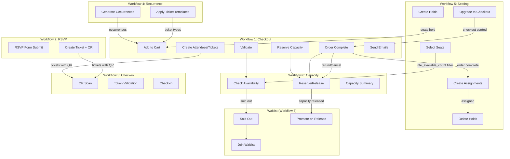

# Workflow Specifications

> **Audience:** Site administrators and developers who need an end-to-end walkthrough of a specific user journey (event creation, ticket purchase, check-in, waitlist promotion). Each workflow is described as a state machine suitable for bug triage and feature planning.

## Overview

This document describes the 6 major workflows in the NetterTech Events plugin suite as state machines. It is designed for agent consumption when working on bugs or features in these flows.

**Plugins involved:**
- `nettertech-events` (base) -- Checkout, RSVP, Check-in, Recurrence, Capacity/Waitlist
- `nettertech-events-seating` -- Seating Hold/Assign workflow

**How to read the diagrams:**
- Each workflow has a Mermaid `stateDiagram-v2` showing states and transitions
- Happy path flows top-to-bottom or left-to-right
- Error/failure paths branch off with `[error]` or `[fail]` guards
- External triggers (WooCommerce hooks, user actions) are noted in transition labels

---

## 1. Checkout -> Payment -> Ticket -> QR

### State Diagram

```mermaid
stateDiagram-v2
    [*] --> AddToCart: User clicks add to cart

    AddToCart --> Validating: CartHandler::validate_add_to_cart
    Validating --> ValidationFailed: [invalid]
    Validating --> ReservationCreated: [valid]
    ValidationFailed --> [*]: wc_add_notice(error)

    ReservationCreated --> InCart: create_pending_reservation + track_ticket_type
    InCart --> CartUpdated: quantity change
    InCart --> CartItemRemoved: item removed
    InCart --> CartEmptied: cart emptied
    InCart --> Checkout: proceed to checkout

    CartUpdated --> InCart: update reservation
    CartItemRemoved --> InCart: reduce/clear reservation
    CartEmptied --> [*]: clear all session reservations

    Checkout --> PaymentProcessing: WooCommerce payment

    PaymentProcessing --> OrderProcessing: woocommerce_payment_complete / status=processing
    PaymentProcessing --> PaymentFailed: [payment fails]
    PaymentFailed --> InCart: reservation persists until TTL

    OrderProcessing --> IdempotencyCheck: OrderHandler::process_order_object
    IdempotencyCheck --> AlreadyProcessed: [_nte_attendees_created = yes]
    IdempotencyCheck --> CapacityValidation: [first time]
    AlreadyProcessed --> [*]: skip

    CapacityValidation --> OversellDetected: [capacity issues]
    CapacityValidation --> AttendeeCreation: [capacity OK or unlimited]
    OversellDetected --> AttendeeCreation: log warning + order note (does NOT block)

    AttendeeCreation --> TicketCreation: OrderAttendeeCreator::process
    TicketCreation --> QRGeneration: per ticket: generate_ticket_code
    QRGeneration --> CapacityReserved: reserve_capacity + sync_stock

    CapacityReserved --> EmailSending: OrderEmailHandler::handle_order_completed
    EmailSending --> QRFileGeneration: ensure QR code files exist
    QRFileGeneration --> CustomerEmail: send_customer_confirmation
    CustomerEmail --> VenueEmail: send_venue_notifications
    VenueEmail --> [*]: mark _nte_confirmation_email_sent

    state "Cancellation / Refund" as cancel_refund {
        OrderCancelled --> VoidAttendees: handle_order_cancelled
        OrderRefunded --> VoidAttendees: handle_order_refunded (full)
        RefundCreated --> PartialRefund: handle_refund_created (partial)

        VoidAttendees --> CapacityReleased: void status + cancel tickets + release_capacity
        PartialRefund --> QuantityReduced: reduce attendee qty + cancel N tickets + release_capacity
    }
```

### Service Responsibilities

| Step | Service | Method | Input | Output |
|------|---------|--------|-------|--------|
| Validate add-to-cart | `CartHandler` | `validate_add_to_cart()` | product_id, quantity | bool (pass/fail) |
| Pure validation | `CartValidator` | `validate_ticket_purchase()` | TicketType, Occurrence, quantity, cart_qty | `{valid, error, error_code}` |
| Create reservation | `CapacityServiceInterface` | `create_pending_reservation()` | ticket_type_id, quantity, session_key | bool (atomic DB UPDATE on ticket_types.reserved - C1) |
| Clear reservation | `CapacityServiceInterface` | `clear_pending_reservation()` | ticket_type_id, session_key | bool |
| Reservation storage | `ReservationManager` | `create_pending()` | ticket_type_id, qty, session_key | bool (nte_reservations table, per-session tracking - C1) |
| Process order | `OrderHandler` | `process_order_object()` | WC_Order | void |
| Idempotency check | `OrderHandler` | (inline) | order meta `_nte_attendees_created` | skip if `yes` |
| Capacity validation | `OrderCapacityValidator` | `validate()` | WC_Order | array of issues |
| Handle oversell | `OrderCapacityValidator` | `handle_issues()` | WC_Order, issues | order note + hook |
| Create attendees | `OrderAttendeeCreator` | `process()` | WC_Order | `array<ticket_type_id => qty>` |
| Create attendee record | `OrderAttendeeCreator` | `create_attendee_for_occurrence()` | occurrence_id, billing info, item | Attendee saved |
| Create ticket records | `OrderAttendeeCreator` | (inline loop) | attendee, item | Ticket records saved |
| Generate ticket code | `QRCodeService` | `generate_ticket_code()` | (none) | 16-char hex `XXXX-XXXX-XXXX-XXXX` |
| Reserve capacity | `CapacityServiceInterface` | `reserve_capacity()` | ticket_type_id, quantity | void |
| Sync WC stock | `ProductManager` | `sync_stock()` | ticket_type_id | void |
| Send emails | `OrderEmailHandler` | `handle_order_completed()` | order_id | void |
| Generate QR file | `QRCodeService` | `generate_for_ticket()` | Ticket | URL string |
| Render QR image | `QRCodeRenderer` | `generate_png()` / `generate_data_uri()` | check-in URL | PNG data / data URI |
| Render customer email | `EmailTemplateRenderer` | `render_customer_email()` | WC_Order, tickets, settings | HTML |
| Generate ICS | `EmailTemplateRenderer` | `generate_ics_file()` | tickets | temp file path |
| Void attendees | `OrderHandler` | `void_attendees_for_order()` | WC_Order | void |
| Process partial refund | `OrderRefundProcessor` | `process()` | WC_Order_Refund, parent order | `array<ticket_type_id>` |
| Release capacity | `CapacityServiceInterface` | `release_capacity()` | ticket_type_id, quantity | void |

### Decision Points

| Decision | Location | Condition | True Branch | False Branch |
|----------|----------|-----------|-------------|--------------|
| Is event ticket? | `CartHandler::validate_add_to_cart` | `ProductManager::is_event_ticket()` | continue validation | pass through (non-ticket product) |
| Event ended? | `CartValidator::validate_ticket_purchase` | `$occurrence->has_ended()` | reject: `event_ended` | continue |
| On sale? | `CartValidator::validate_ticket_purchase` | `$ticket_type->is_on_sale()` | continue | reject: `not_on_sale` |
| Min/max per order | `CartValidator::validate_ticket_purchase` | total_qty vs min/max | reject if outside | continue |
| Capacity available? | `CartValidator::validate_ticket_purchase` | `capacity_service->has_availability()` | continue | reject: `sold_out` or `insufficient_capacity` |
| Already processed? | `OrderHandler::process_order_object` | meta `_nte_attendees_created` = `yes` | skip entirely | process |
| Capacity issues? | `OrderHandler::process_order_object` | `capacity_validator->validate()` returns issues | log warning (still processes) | clean processing |
| Series pass? | `OrderAttendeeCreator::process` | item meta `_nte_is_series_pass` = `yes` | create attendees for ALL occurrences | create for single occurrence |
| Fully refunded? | `OrderRefundProcessor::process` | parent order status = `refunded` | skip (full refund handled by `handle_order_refunded`) | process partial |

### Error Paths

| Error | Trigger | Handler | User Impact |
|-------|---------|---------|-------------|
| Validation failure | add-to-cart | `wc_add_notice()` error | WC error notice; item not added |
| Payment failure | WooCommerce payment | WC handles | Reservation persists until transient TTL expires |
| Oversell at payment | `OrderCapacityValidator::validate` | Order note + `nte_capacity_oversell_detected` hook | Order still processes; staff alerted |
| Attendee creation failure | `OrderAttendeeCreator` RuntimeException | `nte_attendee_creation_failed` hook fires | Attendee for that item not created; other items unaffected |
| Email send failure | `wp_mail()` throws | `DebugLogger::exception()` | Order completes but email not sent; meta not set so retry possible |
| Order cancelled | `woocommerce_order_status_cancelled` | `void_attendees_for_order()` | All attendees voided, tickets cancelled, capacity released |
| Full refund | `woocommerce_order_status_refunded` | `void_attendees_for_order()` | Same as cancellation |
| Partial refund | `woocommerce_refund_created` | `OrderRefundProcessor::process()` | Attendee qty reduced, N tickets cancelled, capacity partially released |

### Resolved Design Decisions

- **[RESOLVED]** Oversell at payment time: partial fulfillment is correct. Must add failure notification + prevent billing for failed item. See task #23.
- **[RESOLVED]** Per-item independence in `OrderAttendeeCreator`: partial fulfillment is intended (least surprise). But failed items must trigger admin notification, customer notification, and refund. Currently silent. See task #23.
- **[RESOLVED]** Idempotency check race window: replace flag-before-create pattern with atomic database operation (`UPDATE WHERE meta_value != 'yes'`, check `affected_rows`). Eliminates race entirely. See task #24.

---

## 2. RSVP Flow (No WooCommerce)

### State Diagram

```mermaid
stateDiagram-v2
    [*] --> FormDisplayed: RSVPFormShortcode renders form

    FormDisplayed --> FormSubmitted: User submits RSVP form
    FormSubmitted --> Validating: sanitize + validate fields
    Validating --> ValidationFailed: [invalid]
    Validating --> AttendeeCreated: [valid] create Attendee record
    ValidationFailed --> FormDisplayed: show errors

    AttendeeCreated --> HookFired: do_action(nte_rsvp_submitted, attendee)

    HookFired --> TicketCreated: RsvpEmailHandler::handle_rsvp_submitted
    TicketCreated --> QRGenerated: generate_ticket_code + generate_for_ticket
    QRGenerated --> CustomerEmailSent: send_rsvp_confirmation
    CustomerEmailSent --> VenueEmailSent: send_rsvp_venue_notification
    VenueEmailSent --> [*]: success response
```

### Service Responsibilities

| Step | Service | Method | Input | Output |
|------|---------|--------|-------|--------|
| Render form | `RSVPFormShortcode` | `render()` / `process_form()` | shortcode attrs | HTML form |
| Create attendee | `RSVPFormShortcode` | `process_form()` | form data | Attendee record |
| Fire RSVP hook | `RSVPFormShortcode` | (inline) | `do_action(nte_rsvp_submitted, attendee)` | -- |
| Handle RSVP | `RsvpEmailHandler` | `handle_rsvp_submitted()` | attendee_id, form_data | void |
| Create ticket | `RsvpEmailHandler` | `create_rsvp_ticket()` | attendee_id, form_data | Ticket |
| Generate ticket code | `QRCodeService` | `generate_ticket_code()` | (none) | `XXXX-XXXX-XXXX-XXXX` |
| Generate QR file | `QRCodeService` | `generate_for_ticket()` | Ticket | URL |
| Render confirmation | `EmailTemplateRenderer` | `render_rsvp_confirmation()` | ticket, settings, name | HTML |
| Generate ICS | `EmailTemplateRenderer` | `generate_ics_file()` | [ticket] | temp file path |
| Send customer email | `RsvpEmailHandler` | `send_rsvp_confirmation()` | ticket, form_data | bool |
| Resolve venue recipients | `EmailService` | `get_venue_notification_recipients()` | [ticket] | array of emails |
| Send venue notification | `RsvpEmailHandler` | `send_rsvp_venue_notification()` | ticket, form_data | bool |

### Decision Points

| Decision | Location | Condition | True Branch | False Branch |
|----------|----------|-----------|-------------|--------------|
| Customer email disabled? | `RsvpEmailHandler::handle_rsvp_submitted` | `email_service->is_customer_email_disabled()` | skip customer email | send |
| Valid email? | `RsvpEmailHandler::send_rsvp_confirmation` | `is_email($to)` | send | return false |
| Venue recipients exist? | `RsvpEmailHandler::send_rsvp_venue_notification` | `empty($recipients)` | return false | send to all |

### Error Paths

| Error | Trigger | Handler | User Impact |
|-------|---------|---------|-------------|
| Form validation fails | missing/invalid fields | `RSVPFormShortcode` re-renders with errors | Form re-displayed with error messages |
| Ticket creation fails | missing occurrence_id | `create_rsvp_ticket` returns null | No ticket or email sent |
| Email send fails | `wp_mail()` throws | `DebugLogger::exception()` | RSVP recorded but no email |
| ICS generation fails | upload dir unavailable | `generate_ics_file()` returns false | Email sent without .ics attachment |

### Resolved Design Decisions

- **[RESOLVED]** RSVP skips capacity checks: RSVP should respect space capacity when capacity is set. If capacity not set (unlimited), RSVP proceeds unconstrained. See task #16.
- **[RESOLVED]** RSVP always free, no WC: confirmed by design. RSVP is a free, WooCommerce-independent registration path. Price is always `0.0` and no WC order is created. This provides event registration for non-commercial events without requiring WooCommerce.

---

## 3. Check-in Flow

> **Scope note:** The basic admin-side attendee check-in (marking an attendee or party as checked-in from the admin UI) is implemented in Core. The **volunteer/QR check-in flow** described below — including `CheckInTokenService`, `CookieCheckInService`, the `/checkin/{occurrence_id}/{token}/` public URL, and QR scanner UI — is provided by the **NetterTech Events Pro** add-on, not by Core. This workflow document covers the full suite flow; sites running Core alone will have the admin check-in path only.

### State Diagram

```mermaid
stateDiagram-v2
    [*] --> QRScanned: Attendee/volunteer scans QR code

    QRScanned --> TicketURLResolved: TicketRouter resolves /ticket/{code}/
    TicketURLResolved --> TicketLookup: find ticket by code

    TicketLookup --> TicketNotFound: [no match]
    TicketLookup --> TicketFound: [match]
    TicketNotFound --> ErrorPage: invalid ticket message

    TicketFound --> VolunteerCookieCheck: CookieCheckInService::validate_volunteer_cookie
    VolunteerCookieCheck --> AttendeeView: [no cookie] show "present at door" message
    VolunteerCookieCheck --> VolunteerView: [valid cookie] auto check-in flow

    AttendeeView --> [*]: attendee shows phone to volunteer

    VolunteerView --> AlreadyCheckedIn: [ticket.status = checked_in]
    VolunteerView --> WrongOccurrence: [occurrence mismatch]
    VolunteerView --> PerformCheckIn: [valid + not checked in]

    AlreadyCheckedIn --> [*]: show "already checked in" message
    WrongOccurrence --> [*]: show wrong event/date message

    PerformCheckIn --> UpdateTicketStatus: set status=checked_in, checked_in_at=now
    UpdateTicketStatus --> UpdateAttendeeStatus: increment check-in count
    UpdateAttendeeStatus --> [*]: show success confirmation

    state "Volunteer Auth Setup" as vol_auth {
        [*] --> CheckInURLAccessed: /checkin/{occurrence_id}/{token}/
        CheckInURLAccessed --> TokenValidation: CheckInTokenService::validate_token
        TokenValidation --> TokenInvalid: [fail]
        TokenValidation --> TokenValid: [pass]
        TokenInvalid --> [*]: access denied
        TokenValid --> SetCookie: CookieCheckInService::set_volunteer_cookie
        SetCookie --> CheckInPageDisplayed: show check-in page for occurrence
    }

    state "Completion Report" as report {
        [*] --> ReportTriggered: volunteer clicks "complete check-in"
        ReportTriggered --> BuildReport: CheckInReportService::build_completion_email
        BuildReport --> ResolveRecipients: get_report_recipients (system + event + occurrence)
        ResolveRecipients --> SendReport: send_completion_report (email + CSV attachment)
        SendReport --> [*]: success/failure response
    }
```

### Service Responsibilities

| Step | Service | Method | Input | Output |
|------|---------|--------|-------|--------|
| Resolve ticket URL | `TicketRouter` | (rewrite rule) | `/ticket/{code}/` | ticket lookup |
| Generate check-in token | `CheckInTokenService` | `generate_token()` | (none) | 96-char hex token |
| Get/create token | `CheckInTokenService` | `get_or_create_token()` | occurrence_id | token string |
| Validate token | `CheckInTokenService` | `validate_token()` | occurrence_id, token | bool |
| Token time window check | `CheckInTokenService` | `is_token_within_valid_window()` | start/end datetimes | bool (24h before to 24h after) |
| Get public URL | `CheckInTokenService` | `get_public_url()` | occurrence_id | `/checkin/{id}/{token}/` URL |
| Set volunteer cookie | `CookieCheckInService` | `set_volunteer_cookie()` | occurrence_id, token | bool |
| Validate cookie | `CookieCheckInService` | `validate_volunteer_cookie()` | occurrence_id | bool |
| Cookie HMAC generation | `CookieCheckInService` | `generate_hmac()` | token, occurrence_id, timestamp | HMAC-SHA256 |
| Build completion email | `CheckInReportService` | `build_completion_email()` | occurrence, stats, counters | `{subject, body}` |
| Resolve report recipients | `CheckInReportService` | `get_report_recipients()` | occurrence_id | array of emails (system + event + occurrence) |
| Send completion report | `CheckInReportService` | `send_completion_report()` | event_title, recipients, subject, body, csv_data | bool |

### Decision Points

| Decision | Location | Condition | True Branch | False Branch |
|----------|----------|-----------|-------------|--------------|
| Ticket found? | `TicketRouter` | ticket_code lookup | proceed | error page |
| Volunteer cookie? | `CookieCheckInService::validate_volunteer_cookie` | cookie exists + HMAC valid + within 12h | volunteer check-in flow | attendee "present at door" view |
| Token format valid? | `CheckInTokenService::validate_token` | 96 hex chars, regex match | continue validation | reject |
| Token matches? | `CheckInTokenService::validate_token` | `hash_equals()` timing-safe comparison | continue | reject |
| Within time window? | `CheckInTokenService::is_token_within_valid_window` | now between (start - 24h) and (end + 24h) | valid | expired/too-early |
| Can set cookie? | `CookieCheckInService::can_set_cookie` | event end + 4h > now | allow | deny |
| Already checked in? | Check-in handler | `ticket.status = checked_in` | show already-checked-in | perform check-in |

### Error Paths

| Error | Trigger | Handler | User Impact |
|-------|---------|---------|-------------|
| Invalid ticket code | code format doesn't match `[A-F0-9]{4}-...` | `QRCodeService::validate_code_format()` | "Invalid ticket" page |
| Ticket not found | no DB match | ticket lookup | "Ticket not found" page |
| Token expired | outside 24h window | `is_token_within_valid_window()` | access denied to check-in page |
| Token tampered | `hash_equals()` fails | `validate_token()` | access denied |
| Cookie expired | timestamp > 12h old or event ended > 4h ago | `validate_volunteer_cookie()` | treated as attendee (no auto-check-in) |
| Already checked in | ticket already has checked_in status | check-in handler | "Already checked in" message |
| Report email fails | `wp_mail()` throws | `DebugLogger::exception()`, temp file cleaned up | "Failed to send" response |

### Resolved Design Decisions

- **[RESOLVED]** Volunteer cookie HMAC uses `SECURE_AUTH_KEY`: acceptable risk. WordPress keys rotate only on manual admin action or security incidents. During a live event, probability of rotation is effectively zero. If keys are rotated during a security incident, invalidating volunteer cookies is correct behavior.
- **[RESOLVED]** `SameSite=Strict` prevents QR scan from external apps: change to `SameSite=Lax`. The check-in cookie identifies a volunteer for a read-only view, not a CSRF-sensitive auth token. Lax sends the cookie on top-level navigations (QR reader -> browser) while still blocking cross-site POST/iframe. See task #25.

---

## 4. Recurrence Generation

### State Diagram

```mermaid
stateDiagram-v2
    [*] --> EventSaved: Admin saves event with recurrence

    state "RRULE Construction" as rrule_build {
        EventSaved --> BuildFromPost: RecurrenceRuleBuilder::build_from_post
        BuildFromPost --> PresetWithEndCondition: [preset selected]
        BuildFromPost --> CustomRule: [custom RRULE provided]
        BuildFromPost --> BuildFromFields: [individual fields: freq, interval, byday]
        PresetWithEndCondition --> RRuleString
        CustomRule --> RRuleString
        BuildFromFields --> RRuleString
    }

    RRuleString --> Validate: RRuleParser::validate
    Validate --> ValidationFailed: [errors]
    Validate --> Parse: [valid]
    ValidationFailed --> [*]: return errors

    Parse --> ParsedRule: RRuleParser::parse -> RecurrenceRule
    ParsedRule --> Generate: OccurrenceGenerator::generate

    state "Generation Engine" as gen_engine {
        Generate --> FreqDispatch: match rule.freq
        FreqDispatch --> DailyGen: [DAILY]
        FreqDispatch --> WeeklyGen: [WEEKLY]
        FreqDispatch --> MonthlyGen: [MONTHLY]
        FreqDispatch --> YearlyGen: [YEARLY]

        DailyGen --> DateList
        WeeklyGen --> DateList
        MonthlyGen --> DateList
        YearlyGen --> DateList
    }

    DateList --> EmptyCheck: count occurrences
    EmptyCheck --> NoOccurrences: [0 generated]
    EmptyCheck --> DeleteExisting: [> 0 generated]
    NoOccurrences --> [*]: return error

    DeleteExisting --> SaveBatch: occurrence_repo::save_batch
    SaveBatch --> ApplyTemplates: apply ticket type templates

    state "Template Application" as templates {
        ApplyTemplates --> GetTemplates: ticket_type_repo::get_templates(event_id)
        GetTemplates --> NoTemplates: [empty]
        GetTemplates --> CreateFromTemplate: [templates exist]
        CreateFromTemplate --> SyncProduct: fire nte_ticket_type_sync_product (if price > 0)
        SyncProduct --> TemplatesDone
        NoTemplates --> TemplatesDone
    }

    TemplatesDone --> HookFired: do_action(nte_occurrences_generated)
    HookFired --> [*]: return {generated, saved, errors}
```

### Service Responsibilities

| Step | Service | Method | Input | Output |
|------|---------|--------|-------|--------|
| Build RRULE from form | `RecurrenceRuleBuilder` | `build_from_post()` | POST data | RRULE string |
| Validate RRULE | `RRuleParser` | `validate()` | rrule string | array of errors |
| Parse RRULE | `RRuleParser` | `parse()` | rrule string | `RecurrenceRule` model |
| Generate occurrences | `OccurrenceGenerator` | `generate()` | Event, start, end, rule, horizon | `array<Occurrence>` |
| Daily generation | `OccurrenceGenerator` | `generate_daily()` | start, rule, horizon | `array<DateTimeImmutable>` |
| Weekly generation | `OccurrenceGenerator` | `generate_weekly()` | start, rule, horizon | `array<DateTimeImmutable>` |
| Monthly generation | `OccurrenceGenerator` | `generate_monthly()` | start, rule, horizon | `array<DateTimeImmutable>` |
| Yearly generation | `OccurrenceGenerator` | `generate_yearly()` | start, rule, horizon | `array<DateTimeImmutable>` |
| Orchestrate generation | `RecurrenceService` | `generate_occurrences()` | Event, start, end, rrule, replace | `{generated, saved, errors}` |
| Delete existing | `OccurrenceRepositoryInterface` | `delete_for_event()` | event_id | void |
| Save batch | `OccurrenceRepositoryInterface` | `save_batch()` | `array<Occurrence>` | int (saved count) |
| Apply templates | `RecurrenceService` | `apply_templates_to_occurrences()` | Event, occurrences | int (created count) |
| Create single occurrence | `RecurrenceService` | `create_single_occurrence()` | Event, start, end, all_day | Occurrence or null |
| Regenerate future | `RecurrenceService` | `regenerate_future_occurrences()` | Event, start, end, rrule | `{generated, saved, deleted, errors}` |
| Cancel occurrence | `RecurrenceService` | `cancel_occurrence()` | occurrence_id | bool |
| Reschedule occurrence | `RecurrenceService` | `reschedule_occurrence()` | occurrence_id, new_start, new_end | Occurrence or null |

### Decision Points

| Decision | Location | Condition | True Branch | False Branch |
|----------|----------|-----------|-------------|--------------|
| COUNT and UNTIL both set? | `RRuleParser::validate` | both non-null | error: mutually exclusive | continue |
| COUNT > 365? | `RRuleParser::validate` | count exceeds limit | error | continue |
| Replace existing? | `RecurrenceService::generate_occurrences` | `$replace = true` | delete all existing for event | append |
| Has end condition? | `RecurrenceRule::has_end()` | count or until set | enforce limit | limit by MAX_OCCURRENCES (365) + horizon (365 days) |
| Monthly: by weekday or day? | `OccurrenceGenerator::generate_monthly` | by_day + by_set_pos both set | Nth weekday of month (e.g., 1st Monday) | by day number (e.g., 15th) |
| Template has price > 0? | `RecurrenceService::apply_templates_to_occurrences` | `$new_ticket->price > 0` | fire `nte_ticket_type_sync_product` hook | skip WC sync |

### Error Paths

| Error | Trigger | Handler | User Impact |
|-------|---------|---------|-------------|
| Empty RRULE | blank input | `RRuleException::emptyRule()` | Validation error returned |
| Missing FREQ | RRULE without FREQ= | `RRuleException::missingComponent()` | Validation error returned |
| Invalid UNTIL date | unparseable date | `RRuleException::invalidComponent()` | Validation error returned |
| Zero occurrences generated | rule + date range produce nothing | RecurrenceService returns error | "No occurrences generated" message |
| Save failure | DB error on occurrence insert | `RuntimeException` caught in `create_single_occurrence` | Logged via DebugLogger, null returned |
| Template creation failure | DB error on ticket type insert | `RuntimeException` caught per template | Logged, other templates still applied |

### Resolved Design Decisions

- **[RESOLVED]** `generate_occurrences` with `replace=true` deletes all including those with attendees: unknown whether protection exists. Must audit and add guard against deleting occurrences with confirmed attendees. See task #26.
- **[RESOLVED]** RRULE without end condition bounded by `MAX_OCCURRENCES`: the one-year horizon is documented. Enhancement: implement rolling generation via WP-Cron (daily job extends the horizon as time passes). See task #27.

---

## 5. Seating: Hold -> Assign

**Plugin:** `nettertech-events-seating`

### State Diagram

```mermaid
stateDiagram-v2
    [*] --> SeatPickerLoaded: User opens seat picker

    SeatPickerLoaded --> MapDataFetched: SeatAvailabilityService::get_map_render_data
    MapDataFetched --> SeatsDisplayed: occurrence -> space -> map -> seats + statuses

    SeatsDisplayed --> SeatsSelected: User clicks seats

    SeatsSelected --> RateLimitCheck: RateLimiterService::check
    RateLimitCheck --> RateLimited: [over limit]
    RateLimitCheck --> AvailabilityCheck: [within limit]
    RateLimited --> SeatsDisplayed: show rate limit error

    AvailabilityCheck --> SomeUnavailable: [seats taken]
    AvailabilityCheck --> AllAvailable: [all available]
    SomeUnavailable --> SeatsDisplayed: show unavailable error

    AllAvailable --> AddToCart: seats added to WC cart

    state "Two-Phase Validation (C3, updated 2026-03-30)" as two_phase {
        AddToCart --> BaseValidation: Base validates at priority 10
        BaseValidation --> BaseInvalid: [event ended / no capacity]
        BaseValidation --> SeatingValidation: [base valid] Seating checks at priority 15
        SeatingValidation --> SeatingInvalid: [seats unavailable]
        SeatingValidation --> AllValidatorsPass: [seats available, read-only check]
        BaseInvalid --> SeatsDisplayed: wc_add_notice(error)
        SeatingInvalid --> SeatsDisplayed: wc_add_notice(error)
    }

    AllValidatorsPass --> HoldsCreated: woocommerce_add_to_cart action (after all validators pass)
    HoldsCreated --> RaceConditionDetected: [ConflictException]
    RaceConditionDetected --> RollbackHolds: release already-created holds
    RollbackHolds --> SeatsDisplayed: show unavailable error

    HoldsCreated --> InCart: hold_type=cart, 15min TTL
    InCart --> CheckoutStarted: user proceeds to checkout

    CheckoutStarted --> HoldsUpgraded: upgrade_to_checkout (hold_type=checkout, 60min TTL - C8)
    HoldsUpgraded --> PaymentProcessing: WooCommerce payment

    PaymentProcessing --> PaymentFailed: [payment fails]
    PaymentProcessing --> OrderComplete: [payment succeeds]

    PaymentFailed --> HoldsPersist: holds still active until TTL
    HoldsPersist --> HoldsExpired: [TTL expires]
    HoldsExpired --> SeatsReleased: sweep_expired cron

    OrderComplete --> AssignmentsCreated: SeatAssignmentService::create_assignment (per seat)
    AssignmentsCreated --> HoldsDeleted: delete_holds_for_order
    HoldsDeleted --> [*]: seats permanently assigned

    state "Cancellation / Refund" as cancel {
        OrderCancelled --> CancelAssignments: cancel_assignments_for_order
        CancelAssignments --> [*]: assignments deleted, seats freed
    }

    state "Hold Lifecycle" as hold_lc {
        HoldActive --> ExtendHold: extend_hold (default +5min)
        HoldActive --> ReleaseHold: release_hold
        HoldActive --> HoldExpired: TTL expires
        HoldExpired --> SweptByCron: sweep_expired
    }
```

### Service Responsibilities

| Step | Service (plugin) | Method | Input | Output |
|------|------------------|--------|-------|--------|
| Get map render data | `SeatAvailabilityService` (seating) | `get_map_render_data()` | occurrence_id | map + sections + seats with statuses |
| Resolve space ID | `SeatAvailabilityService` (seating) | `resolve_space_id()` | occurrence_id | space_id (via `nte_seating_occurrence_space_id` filter) |
| Check seat available | `SeatAvailabilityService` (seating) | `is_seat_available()` | seat_id, occurrence_id | bool |
| Rate limit check | `RateLimiterService` (seating) | `check()` | key, limit, window | bool |
| Create holds (atomic) | `SeatHoldService` (seating) | `create_hold()` | seat_ids, occurrence_id, session_key | hold_ids or WP_Error |
| Release hold | `SeatHoldService` (seating) | `release_hold()` | hold_id | bool |
| Release session holds | `SeatHoldService` (seating) | `release_session_holds()` | session_key | bool |
| Extend hold | `SeatHoldService` (seating) | `extend_hold()` | hold_id, additional_seconds | bool |
| Upgrade to checkout | `SeatHoldService` (seating) | `upgrade_to_checkout()` | session_key, occurrence_id, order_id | int (count) |
| Delete holds for order | `SeatHoldService` (seating) | `delete_holds_for_order()` | order_id | int (count) |
| Sweep expired | `SeatHoldService` (seating) | `sweep_expired()` | (none) | int (count) |
| Create assignment | `SeatAssignmentService` (seating) | `create_assignment()` | seat_id, occurrence_id, ticket_id, attendee_id | SeatAssignment |
| Release assignment | `SeatAssignmentService` (seating) | `release_assignment()` | assignment_id | bool |
| Transfer assignment | `SeatAssignmentService` (seating) | `transfer_assignment()` | assignment_id, new_attendee_id | SeatAssignment |
| Cancel order assignments | `SeatAssignmentService` (seating) | `cancel_assignments_for_order()` | wc_order_id | int (count) |

### Decision Points

| Decision | Location | Condition | True Branch | False Branch |
|----------|----------|-----------|-------------|--------------|
| Rate limit exceeded? | `RateLimiterService::check` | current_count >= limit | return false (429) | allow |
| All seats available? | `SeatingCartHandler::validate_add_to_cart` (priority 15, C3) | read-only availability check | allow add-to-cart (holds created on action, not filter) | WP_Error (unavailable_seats) |
| Race condition on hold? | `SeatHoldService::create_hold` | `ConflictException` during INSERT | rollback all created holds, return WP_Error | continue |
| Hold expired? | `SeatHoldService::extend_hold` | `$hold->is_expired()` | return false | extend |
| Seat already assigned? | `SeatAssignmentService::create_assignment` | `find_by_seat_and_occurrence()` non-null | throw ConflictException | create |
| Ticket IDs available for cancel? | `SeatAssignmentService::cancel_assignments_for_order` | `nte_seating_order_ticket_ids` filter returns IDs | lookup by ticket IDs | fallback: lookup by `_ve_seat_ids` order item meta |

### Error Paths

| Error | Trigger | Handler | User Impact |
|-------|---------|---------|-------------|
| Space not resolved | filter `nte_seating_occurrence_space_id` returns 0 | `NotFoundException` | "Cannot resolve space" error |
| No map for space | `map_repo->find_by_space()` returns null | `NotFoundException` | "No published seating map" error |
| Rate limited | too many requests from IP | `RateLimiterService` | request blocked, try again later |
| Seats unavailable (pre-check) | seats already held/assigned | WP_Error `unavailable_seats` | "Some seats are not available" |
| Race condition (mid-create) | `ConflictException` on INSERT | rollback all holds, WP_Error | "Some seats are not available" |
| Hold expired before checkout | TTL passes | `sweep_expired` deletes | seats become available again; user must re-select |
| Hold expired during payment | TTL passes during long payment | `sweep_expired` deletes | seats freed; potential double-sell (assignment will catch via ConflictException) |
| Assignment conflict | seat assigned between hold-delete and assign | `ConflictException` | "Seat is already assigned" |
| Order cancelled | WC status change | `cancel_assignments_for_order` | assignments deleted, seats freed |

### Resolved Design Decisions

- **[IMPLEMENTED]** (C3, 2026-03-30) Pre-check loop removed. Two-phase hold pattern adopted: Base validates at priority 10 (event active, capacity), Seating checks seat availability at priority 15 (read-only, no hold), holds created on `woocommerce_add_to_cart` action after all validators pass. ConflictException handles TOCTOU races. Zero orphaned holds.
- **[IMPLEMENTED]** (C8, 2026-03-30) Hold durations and slow payment gateways: checkout hold default extended to 60min (filterable). Gateway-aware behavior: `is_offline_gateway()` detects BACS/cheque/COD (filterable via `nte_seating_is_offline_gateway`). Real-time gateways enforce 60min TTL with sweep. Offline gateways assign seats immediately on order creation (no TTL wait). Cancellation releases both holds (real-time) and assignments (offline).
- **[RESOLVED]** `cancel_assignments_by_seat_meta` uses `_ve_` prefix: part of the `_ve_` -> `_nte_` rebrand migration. Not backward compat -- unintentional.

---

## 6. Capacity / Waitlist

### State Diagram

```mermaid
stateDiagram-v2
    [*] --> CapacityCheck: check availability for ticket type

    state "Capacity Resolution" as cap_res {
        CapacityCheck --> ExternalOverride: apply_filters(nte_available_count)
        ExternalOverride --> OverrideReturned: [non-null override]
        ExternalOverride --> DefaultCalculation: [null, use default]

        DefaultCalculation --> CheckCache: wp_cache_get
        CheckCache --> CacheHit: [cached]
        CheckCache --> FreshCalculation: [miss or skip_cache]

        FreshCalculation --> GetBaseAvailable: ticket_type_repo::get_available_count
        GetBaseAvailable --> Unlimited: [null = unlimited]
        GetBaseAvailable --> SubtractBuffer: [finite capacity]
        SubtractBuffer --> SubtractReserved: - buffer_stock
        SubtractReserved --> EffectiveAvailable: - reserved (atomic DB column, C1)
        EffectiveAvailable --> CacheAndReturn: wp_cache_set

        Unlimited --> [*]: return null
        CacheHit --> [*]: return cached value
        OverrideReturned --> [*]: return override
        CacheAndReturn --> [*]: return available count
    }

    state "Availability Summary" as summary {
        [*] --> GetSummary: get_capacity_summary
        GetSummary --> ComputeFlags: calculate is_sold_out, is_low_stock
        ComputeFlags --> [*]: return full summary
    }

    state "Waitlist Flow" as waitlist {
        [*] --> SoldOut: capacity = 0

        SoldOut --> OfferWaitlist: display waitlist form
        OfferWaitlist --> JoinSubmitted: user submits email, name
        JoinSubmitted --> DuplicateCheck: find_by_email
        DuplicateCheck --> AlreadyOnList: [waiting or notified]
        DuplicateCheck --> NewEntry: [not found or removed/expired]
        DuplicateCheck --> Rejoin: [removed/expired/converted]

        AlreadyOnList --> [*]: throw ValidationException
        NewEntry --> SaveEntry: create WaitlistEntry (position = next)
        Rejoin --> SaveEntry: reuse existing row, reset status
        SaveEntry --> HookFired: do_action(nte_waitlist_joined)
        HookFired --> [*]: return entry

        state "Promotion" as promo {
            [*] --> CapacityReleased: refund/cancellation frees capacity
            CapacityReleased --> PromoteNext: WaitlistService::promote_next
            PromoteNext --> QueueEmpty: [no waiting entries]
            PromoteNext --> EntryNotified: [entry found] set status=notified
            QueueEmpty --> [*]
            EntryNotified --> HookFired2: do_action(nte_waitlist_promoted)
            HookFired2 --> [*]: Pro plugin sends notification email
        }

        state "Conversion" as conv {
            [*] --> NotifiedUser: user receives "spot available" email
            NotifiedUser --> PurchasesTicket: user completes purchase
            PurchasesTicket --> MarkConverted: mark_converted(entry_id)
            MarkConverted --> [*]: status=converted
        }

        state "Leave" as leave_wl {
            [*] --> LeaveRequested: user requests removal
            LeaveRequested --> FindEntry: find_by_email
            FindEntry --> NotFound: [no entry]
            FindEntry --> UpdateRemoved: set status=removed
            NotFound --> [*]: return false
            UpdateRemoved --> HookFired3: do_action(nte_waitlist_left)
            HookFired3 --> [*]: return true
        }
    }
```

### Service Responsibilities

| Step | Service | Method | Input | Output |
|------|---------|--------|-------|--------|
| Get available count | `CapacityCalculator` | `get_available_count()` | ticket_type_id, include_pending, skip_cache | int or null |
| Get total capacity | `CapacityCalculator` | `get_total_capacity()` | ticket_type_id | int or null |
| Get sold count | `CapacityCalculator` | `get_sold_count()` | ticket_type_id | int |
| Get buffer stock | `CapacityCalculator` | `get_buffer_stock()` | ticket_type_id | int |
| Get capacity summary | `CapacityCalculator` | `get_capacity_summary()` | ticket_type_id, skip_cache | full summary array |
| Get occurrence capacity | `CapacityCalculator` | `get_occurrence_capacity()` | occurrence_id, skip_cache | aggregated summary |
| Get reserved count | `ReservationManager` | `get_reserved_count()` | ticket_type_id | int (from ticket_types.reserved column - C1) |
| Create pending reservation | `ReservationManager` | `create_pending()` | ticket_type_id, qty, session_key | bool (atomic DB UPDATE on ticket_types.reserved; per-session row in nte_reservations - C1) |
| Clear pending reservation | `ReservationManager` | `clear_pending()` | ticket_type_id, session_key | bool (atomic DB UPDATE decrements reserved; removes nte_reservations row - C1) |
| Sweep expired reservations | WP-Cron | `ReservationManager::sweep_expired()` | (hourly) | int (clears expired nte_reservations rows, decrements ticket_types.reserved - C1) |
| Get the house (seats a tier sells into) | `HouseRule` | `house()` | tiers, occurrence ceiling | int or null (null = unbounded; never the sum of tiers — ADR-019) |
| Get availability for a ticket type | `CapacityService` | `get_available_count()` | ticket_type_id | int or null (floored by the house remainder) |
| Join waitlist | `WaitlistService` | `join()` | occurrence_id, email, name, phone, ticket_type_id | WaitlistEntry |
| Leave waitlist | `WaitlistService` | `leave()` | occurrence_id, email | bool |
| Get position | `WaitlistService` | `get_position()` | occurrence_id, email | int or null |
| Get queue | `WaitlistService` | `get_queue()` | occurrence_id, status | `array<WaitlistEntry>` |
| Get count | `WaitlistService` | `get_count()` | occurrence_id | int |
| Promote next | `WaitlistService` | `promote_next()` | occurrence_id | WaitlistEntry or null |
| Mark converted | `WaitlistService` | `mark_converted()` | entry_id | bool |
| Is on waitlist? | `WaitlistService` | `is_on_waitlist()` | email, occurrence_id | bool |

### Decision Points

| Decision | Location | Condition | True Branch | False Branch |
|----------|----------|-----------|-------------|--------------|
| External override? | `CapacityCalculator::get_available_count` | `nte_available_count` filter returns non-null | use override (e.g., seating plugin) | default calculation |
| Unlimited capacity? | `CapacityCalculator::get_available_count` | `get_available_count()` returns null | return null (unlimited) | subtract buffer + pending |
| Sold out? | `CapacityCalculator::get_capacity_summary` | effective_available <= 0 AND not unlimited | `is_sold_out = true` | check low stock |
| Low stock? | `CapacityCalculator::get_capacity_summary` | effective_available <= 10% of capacity | `is_low_stock = true` | normal |
| Already on waitlist? | `WaitlistService::join` | `find_by_email()` returns entry with status `waiting` or `notified` | throw ValidationException | create/rejoin |
| Re-joining? | `WaitlistService::join` | existing entry with status `removed`/`expired`/`converted` | reuse row, reset position + status | create new entry |
| Queue empty? | `WaitlistService::promote_next` | `get_next_in_queue()` returns null | return null | promote entry |

### Error Paths

| Error | Trigger | Handler | User Impact |
|-------|---------|---------|-------------|
| Ticket type not found | invalid ticket_type_id | `CapacityCalculator` returns null/0/defaults | Treated as unlimited or zero depending on method |
| Already on waitlist | duplicate email for same occurrence | `ValidationException` | "Already on the waitlist" message |
| Waitlist entry not found | leave with non-existent email | `WaitlistService::leave` returns false | Silent no-op |

### Resolved Design Decisions

- **[RESOLVED]** `promote_next` fires hook, base doesn't send email: move waitlist notification emails from Pro to Base. A waitlist that doesn't notify is broken/crippleware. Free users get complete waitlist functionality. See task #28.
- **[RESOLVED]** Buffer stock UI: no admin UI exists currently. Add a field to the ticket type editor metabox. See task #14.
- **[RESOLVED]** Seating override bypasses buffer/pending: seating correctly owns its own capacity math (discrete seats), but must be capped by base space capacity. Buffer doesn't apply to mapped seating. See task #15.

---

## Cross-Workflow Dependencies



### Key Cross-Plugin Boundaries

| Interaction | Source Plugin | Target Plugin | Mechanism |
|------------|--------------|---------------|-----------|
| Seating overrides capacity | `nettertech-events-seating` | `nettertech-events` | `nte_available_count` filter |
| Space resolution for seating | `nettertech-events-seating` | `nettertech-events` (Base owns spaces - C2) | `SpaceRepositoryInterface` (no direct `$wpdb`) |
| Order ticket IDs for assignment cancel | `nettertech-events` | `nettertech-events-seating` | `nte_seating_order_ticket_ids` filter |
| Ticket IDs stored on order item | `nettertech-events` (OrderAttendeeCreator) | `nettertech-events-seating` | `_nte_ticket_ids` order item meta |
| Attendee created hook | `nettertech-events` (OrderAttendeeCreator) | `nettertech-events-seating` | `nte_attendee_created` action |
| Registration voided hook | `nettertech-events` (OrderHandler) | `nettertech-events-seating` | `nte_registration_voided` action |
| Waitlist promotion notification | `nettertech-events` (WaitlistService) | `nettertech-events-pro` | `nte_waitlist_promoted` action |
| Ticket type sync to WC product | `nettertech-events` (RecurrenceService) | WooCommerce integration | `nte_ticket_type_sync_product` action |
| Hold duration configuration | Site admin | `nettertech-events-seating` | `nte_seating_cart_hold_duration` / `nte_seating_checkout_hold_duration` filters |

### Shared Services

| Service | Used By Workflows | Purpose |
|---------|-------------------|---------|
| `QRCodeService` | 1 (Checkout), 2 (RSVP) | Ticket code generation + QR image creation |
| `EmailTemplateRenderer` | 1 (Checkout), 2 (RSVP) | HTML email rendering + ICS generation |
| `EmailService` | 1 (Checkout), 2 (RSVP) | Settings management + venue recipient resolution |
| `CapacityCalculator` | 1 (Checkout), 5 (Seating), 6 (Capacity) | Availability calculations |
| `ReservationManager` | 1 (Checkout), 6 (Capacity) | Atomic DB-based pending reservations (ticket_types.reserved + nte_reservations table - C1) |
| `OccurrenceRepositoryInterface` | All workflows | Occurrence CRUD, used by every flow |
| `TicketRepositoryInterface` | 1 (Checkout), 2 (RSVP), 3 (Check-in) | Ticket CRUD and status updates |
